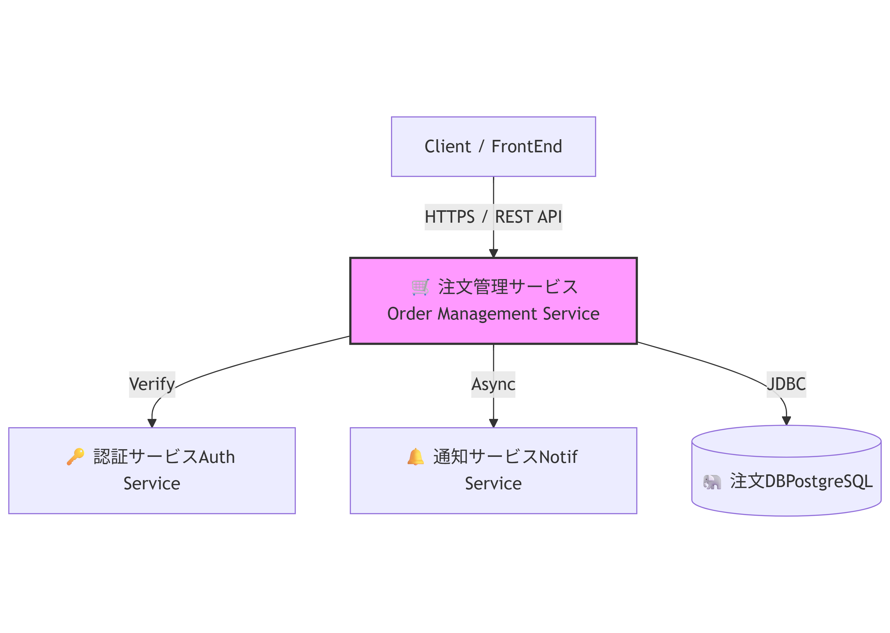

# **🛒 注文管理マイクロサービス (Kotlin / Spring Boot)**

## **🏆 プロジェクトの目的と即戦力アピール**

【即戦力アピール】  
本プロジェクトは、エンタープライズ領域で求められる堅牢性、保守性、セキュリティを念頭に設計・実装されたマイクロサービスのプロトタイプです。当社のエンジニアが、Javaの確かな経験をベースに、Kotlinのモダンな機能（Null安全、Coroutinesなど）を最大限に活用し、業務ロジックの設計・開発・テストを全て担当できることを証明します。  
**本ポートフォリオでカバーできる主要な技術要件:**

* RESTful API設計と実装  
* トランザクションとデータ整合性の厳密な管理  
* レイヤードアーキテクチャによる高い保守性の実現  
* 高いユニットテストカバレッジによる品質保証

## **📚 ドキュメント (Documents)**

本プロジェクトの詳細な仕様については、以下のドキュメントを参照してください。

* [**要件定義書 (Requirements)**](./docs/requirements.md)  
  * システム構成図、ER図、機能要件、API仕様の詳細などを記載しています。

## **🛠️ 採用技術スタック**

| カテゴリ | 採用技術 | 採用理由 (アピールポイント) |
| :---- | :---- | :---- |
| **言語 / FW** | Kotlin 1.x, Spring Boot 3.x | Javaとの互換性を保ちつつ、Kotlinの簡潔さで開発速度と安全性を向上させるため。 |
| **データベース** | PostgreSQL / Spring Data JPA | 本番環境での実績が豊富なRDBMSを採用し、複雑なクエリにも対応可能なORMを選択。 *(開発時はH2 Databaseを使用)* |
| **品質保証** | JUnit 5, Mockk | Kotlinネイティブなモックライブラリを使用し、テスト駆動の考え方に基づいた品質保証を実現。 |

## **🧠 システム構成と設計思想**

### **1\. システム概要とアーキテクチャ**

本サービスは、認証、通知、ログサービスと**疎結合**で連携するマイクロサービスとして設計されています。

**【マイクロサービス連携図】**

* **アーキテクチャスタイル:** レイヤード・アーキテクチャ（Presentation / Application / Domain / Infrastructure）を厳格に適用し、業務ロジックとインフラストラクチャを分離することで高い**保守性**と**テスト容易性**を確保しています。

### **2\. 堅牢性の確保と品質**

* 厳密なトランザクション管理:  
  OrderService.createOrder()メソッドでは、在庫の仮引き当て（モック）とDBへの注文登録を単一のトランザクション（ACID特性）で実行しています。これにより、部分的な失敗を防ぎ、データの整合性を厳密に保証しています。  
* エラーハンドリング:  
  すべてのAPIは、無効な入力には400 Bad Request、リソース不在には404 Not Foundなど、HTTPステータスコードに基づいた適切なJSONレスポンスを返します。

## **⭐ エンジニアのアピールポイント（担当者記入欄）**

**【⚠️ 担当エンジニア記入必須】** このセクションに、ご自身の専門性、具体的な成果、およびスキルを記入してください。

| 項目 | 記入スペース (具体的な成果を記入してください) |
| :---- | :---- |
| **コード品質とテスト** | \[ここに具体的なカバレッジ（例: **95% UT達成**）や、テストで検証した困難なケース、使用したモック技術の工夫点を記入してください。\] |
| **技術的なこだわりと工夫** | \[ここに、KotlinのCoroutinesを用いた非同期インターフェースの設計、Null安全性を徹底した実装、またはJava経験を活かした設計のポイントなど、独自のアピールポイントを記入してください。\] |
| **苦労した点と解決プロセス** | \[ここに、苦労した点と解決プロセスなどを記入してください。\] |
| **ドキュメント・運用** | \[ここに、構造化ログの詳細スキーマ（例: Kibanaで検索容易）、APIドキュメントの工夫、またはシステムのデバッグ容易性への配慮などを記入してください。\] |

## **🛠️ API仕様とローカル実行手順**

### **1\. 主要APIエンドポイント**

| 機能 | HTTPメソッド | エンドポイント | 説明 |
| :---- | :---- | :---- | :---- |
| 注文作成 | POST | /orders | 注文を登録し、合計額を計算（トランザクション処理） |
| 注文参照 | GET | /orders/{orderId} | 単一の注文詳細を取得 |

### **2\. cURLコマンド例**

\# 注文作成の例 (HTTPステータス 201 CREATED が期待される)  
curl \-X POST "http://localhost:8080/orders" \\  
\-H "Authorization: Bearer \<VALID\_MOCK\_JWT\_TOKEN\>" \\  
\-H "Content-Type: application/json" \\  
\-d '{  
  "customerId": 101,   
  "items": \[  
    {"productId": 1, "quantity": 2},   
    {"productId": 5, "quantity": 1}  
  \]  
}'

### **3\. ローカル実行手順**

1. リポジトリのクローン:  
   git clone \[リポジトリURL\]  
2. ビルドと起動:  
   ./gradlew bootRun  
3. テスト実行:  
   ./gradlew test