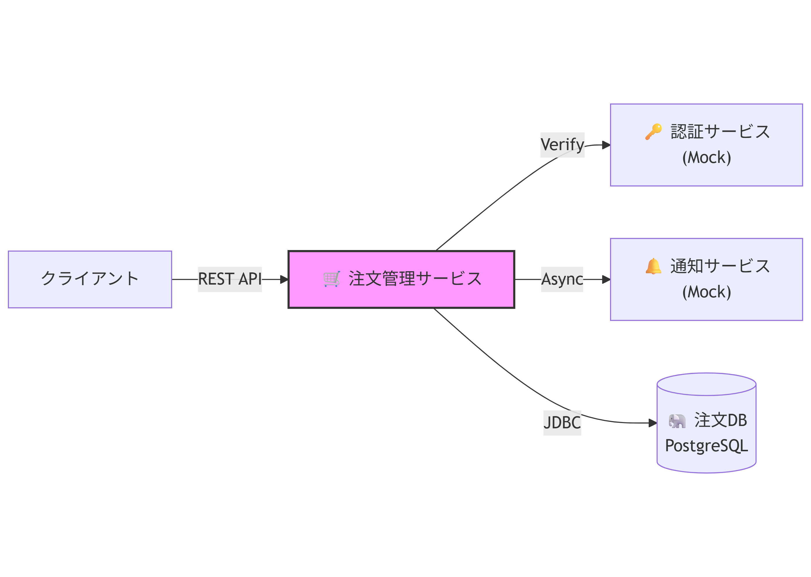

# **注文管理マイクロサービス 要件定義書**

## **1\. プロジェクト概要**

本プロジェクトは、SES提案時にエンジニアの即戦力スキル（設計・実装・テスト・ドキュメント作成）を証明するためのポートフォリオを作成することを目的とする。  
本サービスは、ECサイトにおける「注文管理」を担うマイクロサービスであり、エンタープライズ開発で求められる堅牢性、保守性、セキュリティ要件を網羅する。

### **対象読者**

* 本ポートフォリオの実装を担当するエンジニア  
* 本プロジェクトのレビュアーおよび営業担当者

### **1-1. ECサイト全体における位置づけ (Context Map)**

一般的なECサイトにおいて、本サービスは\*\*「購入ボタン押下後」から「商品発送・受取」までのコアプロセス\*\*を担当する。

**【ECシステム全体俯瞰図】**

### **1-2. 本サービスの担当範囲 (Scope)**

* **担当する (Scope In)**:  
  * 注文データの作成と保存  
  * 請求金額（商品合計 \+ 税 \+ 送料）の計算ロジック  
  * 注文ステータスの遷移管理  
    * PENDING (入金待ち) $\\to$ PAID (発送準備中) $\\to$ SHIPPED (発送完了) $\\to$ **COMPLETED (配達完了)**  
  * **配送追跡番号の保持と表示**（物流サービスから受領した番号を管理し、ユーザーへ提供する）  
* **担当しない (Scope Out)**:  
  * 商品・在庫・決済の実処理・配送実務（伝票発行など）

## **2\. システム構成**

### **2-1. マイクロサービス連携図**
本サービス（Order Service）は、認証、通知、ログ基盤と連携して動作する。

### **2-2. データモデル (ER図)**
orders テーブルと order\_items テーブルは 1対多 の関係を持つ。
")

**補足:**

* **FK order\_id**: ORDER テーブルの id (PK) を参照する外部キー。  
* **ordered\_at**: 注文確定日時（受付日時）。  
* **tracking\_no**: 配送追跡番号。発送前はNULL。

## **3\. 機能要件 (Functional Requirements)**

| 機能名 | HTTPメソッド | エンドポイント | 説明・振る舞い | 優先度 |
| :---- | :---- | :---- | :---- | :---- |
| **注文作成** | POST | /orders | 顧客ID、商品リストを受け取り、価格計算を行った上で注文を確定する。ステータスは PENDING となる。 | **高** |
| **注文参照** | GET | /orders/{orderId} | 指定されたIDの注文詳細を返す。発送済みの場合は追跡番号を含めること。 | **高** |
| 注文一覧取得 | GET | /orders | 注文履歴をリスト形式で返す。顧客IDによるフィルタリングやページネーションを考慮する。 | 中 |
| **ステータス更新** | PUT | /orders/{orderId}/status | 注文ステータスを更新する。 1\. SHIPPED（発送済）への遷移時は**追跡番号**を必須とする。 2\. COMPLETED（配達完了）への遷移は物流サービスからの通知を想定する。 | 中 |
| **価格計算** | \- | (内部ロジック) | 商品単価 × 数量 の合計を計算する。今回は単価はモックまたは固定値でよいが、計算ロジックはサービス層に実装する。 | **高** |

※ **優先度「高」** の機能をMVP（Minimum Viable Product）として最優先で実装すること。

**【ステータス遷移定義】**

* PENDING: 注文受付直後（未払い/在庫引当待ち）  
* PAID: 支払い完了・発送準備中  
* SHIPPED: 運送会社へ引き渡し済み（**追跡番号あり**）  
* COMPLETED: ユーザーへの配達完了  
* CANCELLED: 注文キャンセル

## **4\. 技術・設計要件 (Technical Requirements)**

即戦力としてのアピールポイントとなる、設計・実装上の制約事項。

| カテゴリ | 要件詳細 | アピールポイント |
| :---- | :---- | :---- |
| **アーキテクチャ** | **レイヤードアーキテクチャ** (Controller / Service / Repository) を厳格に守ること。ビジネスロジックは必ずService層に記述する。 | 保守性、責務の分離 |
| **DI / IoC** | Spring BootのDIコンテナを活用し、コンストラクタインジェクションを用いて依存関係を注入すること。 | 疎結合、テスト容易性 |
| **データ永続化** | DB操作には **JPA (Hibernate)** を使用する。 **※補足**: 開発およびデモ実行の容易性を優先し、ローカル環境では **H2 Database** (In-Memory) の使用を推奨する。ただし、アーキテクチャとしてはPostgreSQLを想定し、本番用の設定を意識すること。 | ORMの理解、環境適応力 |
| **トランザクション** | **注文作成** などの更新処理には @Transactional を付与し、例外発生時に確実にロールバックされるようにする。 | データ整合性 (ACID) |
| **エラー処理** | 例外発生時は、適切な **HTTPステータスコード** (400, 404, 500\) と、JSON形式のエラーメッセージを返すこと。 | API設計標準 |

## **5\. 連携・品質要件 (Integration & Quality)**

システムの信頼性と運用性を担保するための要件。

| カテゴリ | 要件詳細 | 実装方針 |
| :---- | :---- | :---- |
| **認証連携** | APIリクエストヘッダーの Authorization: Bearer \<token\> をチェックする。 **※補足**: トークン自体に情報が含まれるため、**DBでのトークン管理・保存は不要**。検証ロジックはモックで可。 | ControllerまたはFilterで実装 |
| **非同期連携** | 注文確定後、外部システムへ通知するためのイベント発行インターフェースを持つこと（ログ出力で代替可）。 | Service層の処理完了後に実行 |
| **ログ出力** | 主要な操作（注文作成など）は、追跡可能なJSON形式のログを\*\*標準出力（コンソール）\*\*に出力すること。 {"event": "ORDER\_CREATED", "orderId": 123, ...} | SLF4J / Logback を使用 |
| **ユニットテスト** | **重要:** Service層のビジネスロジック（価格計算、ステータス遷移）に対し、**カバレッジ80%以上** のテストを記述すること。 | JUnit 5, Mockk を使用 |

## **6\. 実装ステップ (推奨)**

メンバーは以下の順序で実装を進めることを推奨する。

1. **環境構築**: GitHubリポジトリのクローンと build.gradle.kts の設定反映。  
   * *DB設定について*: 初回は H2 Database で動作確認を行うことを推奨する。  
2. **Model層の実装**: Order, OrderItem エンティティとAPI用DTOの定義。  
   * *変更点*: ordered\_at, tracking\_no カラムの実装をお忘れなく。  
3. **Repository層の実装**: OrderRepository インターフェースの定義。  
4. **Service層の実装**: 価格計算ロジックとトランザクション管理を含む createOrder メソッドの実装。  
5. **テスト実装**: Service層に対するユニットテストを作成し、ロジックの正当性を確認。  
6. **Controller層の実装**: APIエンドポイントの開放とエラーハンドリングの実装。  
7. **READMEの更新**: 自身の担当部分のアピールポイントを記入。

## **7\. 参考資料 (Reference)**

実装時に参照すべき技術ドキュメントや、概念理解のための資料。

### **JWT (JSON Web Token)**

JWTの仕組みやデコードの確認に利用する。

* **JWT公式サイト (Debugger)**: [https://jwt.io/](https://jwt.io/)  
  * トークンを貼り付けると中身（Header, Payload）が見えるため、仕組みの理解に最適。  
* **JWTの仕組み解説 (Auth0)**: [https://auth0.com/ja/learn/json-web-token](https://www.google.com/search?q=https://auth0.com/ja/learn/json-web-token)

### **Spring Boot / Kotlin**

* **Spring Boot Reference Guide**: [https://spring.io/projects/spring-boot](https://spring.io/projects/spring-boot)  
* **Spring Data JPA**: [https://spring.io/projects/spring-data-jpa](https://spring.io/projects/spring-data-jpa)  
* **Kotlin Language Guide**: [https://kotlinlang.org/docs/home.html](https://kotlinlang.org/docs/home.html)

### **テスト・モック**

* **Mockk (Kotlin用モックライブラリ)**: [https://mockk.io/](https://mockk.io/)  
* **JUnit 5 User Guide**: [https://junit.org/junit5/docs/current/user-guide/](https://junit.org/junit5/docs/current/user-guide/)